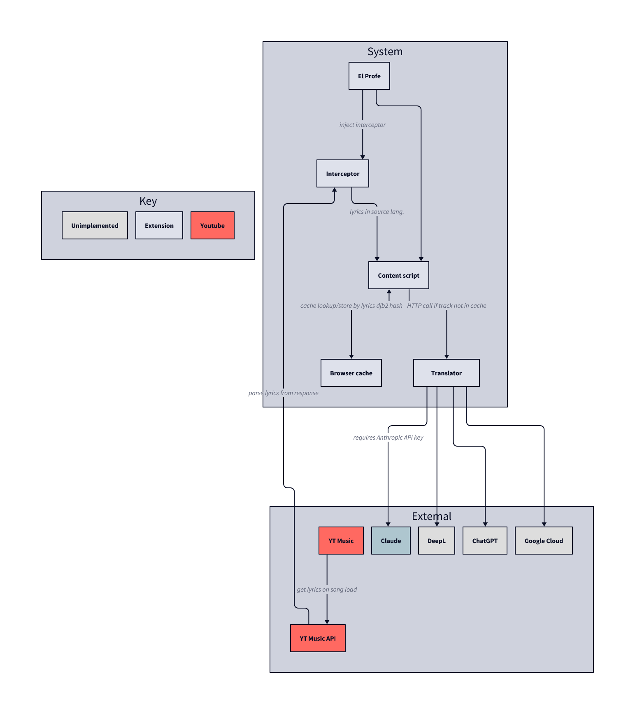

### El Profe

A simple Firefox extension that performs DOM manipulation to insert translated lyrics in-line in the Youtube Music SPA. Enable/disable through toolbar, lyrics will be auto-detected and translated to language configured through toolbar.

Translation requires a Translator module to be configured. Currently supported modules:

- Claude: requires Anthropic API key and uses Claude Haiku 4.5

⚠️ While you can see token usage by the extension, you **cannot** place a limit currently so please monitor usage ⚠️

#### What does it do?

Generated with [D2](https://d2lang.com/).

#### Disclosures

##### AI usage disclosure

This extension was built collaboratively with Claude Code. However, development was done iteratively with consistent review & pieces of human written code. This is **not** vibe coded, and I've reviewed everything that was written multiple times - so it's prone to be very buggy and not feature complete :)

##### Information disclosure

This extension does not store private information, does not send telemetry anywhere and all of its data is stored in your browser local storage. However, API keys that you choose to store in browser storage are **NOT** encrypted so please be aware.